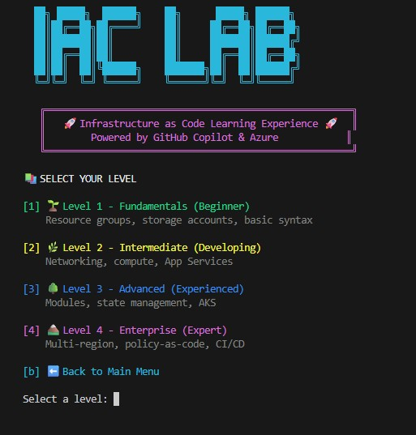

# 🚀 GitHub Copilot Infrastructure as Code Lab

A hands-on learning lab demonstrating **GitHub Copilot SDK** and **GitHub CLI** capabilities for writing Infrastructure as Code with **Terraform** and **Bicep**.

## 📋 Overview

This lab provides progressive learning paths from fundamentals to enterprise patterns, with dedicated sections for demonstrating Copilot's AI-powered coding capabilities.

### Learning Tracks

| Level | Focus | Terraform Topics | Bicep Topics |
|-------|-------|------------------|--------------|
| **Level 1** | Fundamentals | Providers, resources, variables, outputs | Resources, parameters, variables, outputs |
| **Level 2** | Intermediate | Networking, compute, data sources, loops | VNets, VMs, conditions, loops, decorators |
| **Level 3** | Advanced | Modules, remote state, AKS | Modules, deployment scopes, AKS |
| **Level 4** | Enterprise | Multi-region, policy-as-code, CI/CD | Deployment stacks, template specs, CI/CD |

### Copilot Demos

Dedicated demonstrations showcasing:
- 🎯 **Code Generation** - Generate IaC from natural language
- 📖 **Code Explanation** - Understand complex configurations
- 🔧 **Error Fixing** - AI-assisted troubleshooting
- ♻️ **Refactoring** - Transform and optimize code
- 💻 **GitHub CLI Integration** - `gh copilot` commands

### 🎮 Interactive CLI Learning Experience

A gamified terminal interface with ASCII art, progress tracking, and celebration animations!



**Features:**
- 🏆 XP points and achievement system
- 📊 Progress tracking across all 24 challenges
- ✅ Auto-validation of your solutions
- 🎉 Celebration animations on completion

**Quick Start:**
```bash
# Windows (PowerShell)
.\cli\iac-lab.ps1

# macOS/Linux (Bash)
./cli/iac-lab.sh
```

---

## 🛠️ Prerequisites

### Required Tools

| Tool | Version | Installation |
|------|---------|--------------|
| **Azure CLI** | >= 2.50 | [Install Guide](https://docs.microsoft.com/cli/azure/install-azure-cli) |
| **Terraform** | >= 1.5 | [Install Guide](https://developer.hashicorp.com/terraform/downloads) |
| **Bicep CLI** | >= 0.22 | `az bicep install` |
| **VS Code** | Latest | [Download](https://code.visualstudio.com/) |
| **Git** | >= 2.40 | [Download](https://git-scm.com/) |
| **GitHub CLI** | >= 2.40 | [Install Guide](https://cli.github.com/) |

### Required VS Code Extensions

```bash
# Install via command line
code --install-extension GitHub.copilot
code --install-extension GitHub.copilot-chat
code --install-extension hashicorp.terraform
code --install-extension ms-azuretools.vscode-bicep
code --install-extension ms-vscode.azure-account
code --install-extension ms-azuretools.vscode-azureterraform
```

### Azure Setup

```bash
# Login to Azure
az login

# Set your subscription
az account set --subscription "YOUR_SUBSCRIPTION_ID"

# Verify
az account show
```

### GitHub CLI Setup

```bash
# Authenticate with GitHub
gh auth login

# Enable Copilot in CLI
gh extension install github/gh-copilot

# Verify
gh copilot --help
```

---

## 📁 Lab Structure

```
copilot-iac/
├── README.md                           # This file
├── .github/
│   └── copilot-instructions.md         # Custom Copilot rules for IaC
│
├── Level-1-Fundamentals/               # 🟢 Beginner
│   ├── terraform/
│   │   ├── 01-hello-azure/
│   │   ├── 02-storage-account/
│   │   └── 03-outputs-locals/
│   └── bicep/
│       ├── 01-hello-azure/
│       ├── 02-storage-account/
│       └── 03-outputs-variables/
│
├── Level-2-Intermediate/               # 🟡 Intermediate
│   ├── terraform/
│   │   ├── 01-networking/
│   │   ├── 02-compute/
│   │   └── 03-app-service/
│   └── bicep/
│       ├── 01-networking/
│       ├── 02-compute/
│       └── 03-app-service/
│
├── Level-3-Advanced/                   # 🟠 Advanced
│   ├── terraform/
│   │   ├── 01-modules/
│   │   ├── 02-state-management/
│   │   └── 03-aks-cluster/
│   └── bicep/
│       ├── 01-modules/
│       ├── 02-deployment-stacks/
│       └── 03-aks-cluster/
│
├── Level-4-Enterprise/                 # 🔴 Enterprise
│   ├── terraform/
│   │   ├── 01-multi-region/
│   │   ├── 02-policy-as-code/
│   │   └── 03-cicd-integration/
│   └── bicep/
│       ├── 01-multi-region/
│       ├── 02-template-specs/
│       └── 03-cicd-integration/
│
├── Copilot-Demos/                      # 🎯 Demo Scenarios
│   ├── 01-code-generation/
│   ├── 02-code-explanation/
│   ├── 03-error-fixing/
│   ├── 04-refactoring/
│   └── 05-gh-cli-integration/
│
└── Solutions/                          # ✅ Reference Solutions
```

---

## 🎯 How to Use This Lab

### For Self-Paced Learning

1. **Start with Level 1** - Complete fundamentals for your preferred tool (Terraform or Bicep)
2. **Progress sequentially** - Each level builds on previous concepts
3. **Use Copilot actively** - Try the suggested prompts in each exercise
4. **Check solutions** - Reference implementations available in `Solutions/`

### For Demonstrations

1. **Navigate to `Copilot-Demos/`** - Self-contained demo scenarios
2. **Follow the demo scripts** - Step-by-step instructions included
3. **Customize as needed** - Adapt prompts for your audience

### Exercise Format

Each exercise folder contains:

```
exercise-folder/
├── README.md           # 📋 Objectives, instructions, Copilot prompts
├── challenge/          # 🎯 Skeleton code with TODOs
├── hints/              # 💡 Progressive hints if stuck
└── solution/           # ✅ Complete working solution
```

---

## 🤖 Copilot Tips for IaC

### Effective Prompts

```markdown
# Good prompts for Terraform
"Create an Azure storage account with blob versioning, soft delete, and private endpoint"
"Refactor this configuration to use for_each instead of count"
"Add input validation for the vm_size variable"

# Good prompts for Bicep
"Create a Bicep module for an App Service with staging slots"
"Explain what the @secure() decorator does"
"Convert this ARM template to Bicep"
```

### Copilot Chat Commands

| Command | Use Case |
|---------|----------|
| `/explain` | Understand selected code |
| `/fix` | Fix errors in selection |
| `/tests` | Generate tests for code |
| `/doc` | Generate documentation |
| `@workspace` | Query entire workspace |

### GitHub CLI Commands

```bash
# Explain a command
gh copilot explain "terraform state mv"

# Get suggestions
gh copilot suggest "import existing Azure resource group into Terraform"

# Explain Azure CLI
gh copilot explain "az deployment group what-if"
```

---

## 📚 Additional Resources

### Documentation
- [Terraform Azure Provider](https://registry.terraform.io/providers/hashicorp/azurerm/latest/docs)
- [Bicep Documentation](https://docs.microsoft.com/azure/azure-resource-manager/bicep/)
- [GitHub Copilot Docs](https://docs.github.com/copilot)

### Learning Paths
- [HashiCorp Learn - Terraform](https://developer.hashicorp.com/terraform/tutorials)
- [Microsoft Learn - Bicep](https://docs.microsoft.com/learn/paths/bicep-deploy/)

---

## 🏷️ Tags & Naming Convention

This lab follows Azure naming conventions:

| Element | Format | Example |
|---------|--------|---------|
| Resource Group | `rg-{workload}-{env}-{region}` | `rg-webapp-dev-eastus` |
| Storage Account | `st{workload}{env}{unique}` | `staboragedev001` |
| Virtual Network | `vnet-{workload}-{env}-{region}` | `vnet-hub-prod-westus` |
| Key Vault | `kv-{workload}-{env}-{region}` | `kv-secrets-dev-eastus` |

### Required Tags

```hcl
# Terraform
tags = {
  environment = "dev"
  project     = "copilot-iac-lab"
  managed_by  = "terraform"
}
```

```bicep
// Bicep
tags: {
  environment: 'dev'
  project: 'copilot-iac-lab'
  managed_by: 'bicep'
}
```

---

## 📝 License

This lab is provided for educational purposes. Feel free to use and modify for your learning and demonstrations.

---

**Happy Learning! 🎉**

*Powered by GitHub Copilot* 🤖
